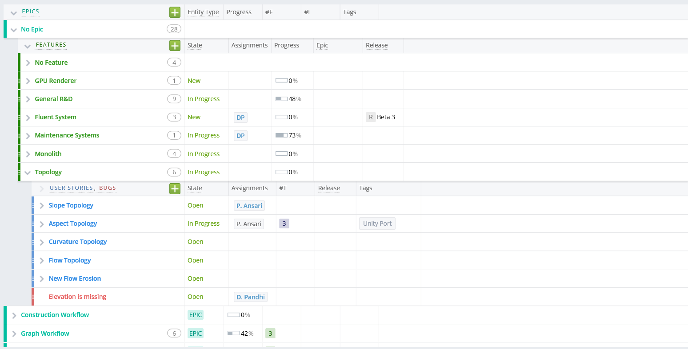

# Colorful Theme

This mashup creates a colorized theme with higher cognition of elements such as cards, tags, and more.

Once you install the mashup, it will automatically activate whenever you open TargetProcess. You can toggle the theme using the `COLORFUL` link at the top of the page.

To disable auto-apply, comment the last line in the mashup script ```initColorfulTheme();```.



### How to use
1. Install the mashup
1. If you wish to auto-apply the theme, you're done. Refresh your browser.
1. If you wish to disable auto-apply, comment the last line in the script, and then save.

## License
Copyright 2015-2017 Dax Pandhi

Extended 2019 Daniel Unterberger

Permission is hereby granted, free of charge, to any person obtaining a copy of this software and associated documentation files (the "Software"), to deal in the Software without restriction, including without limitation the rights to use, copy, modify, merge, publish, distribute, sublicense, and/or sell copies of the Software, and to permit persons to whom the Software is furnished to do so, subject to the following conditions:

The above copyright notice and this permission notice shall be included in all copies or substantial portions of the Software.

THE SOFTWARE IS PROVIDED "AS IS", WITHOUT WARRANTY OF ANY KIND, EXPRESS OR IMPLIED, INCLUDING BUT NOT LIMITED TO THE WARRANTIES OF MERCHANTABILITY, FITNESS FOR A PARTICULAR PURPOSE AND NONINFRINGEMENT. IN NO EVENT SHALL THE AUTHORS OR COPYRIGHT HOLDERS BE LIABLE FOR ANY CLAIM, DAMAGES OR OTHER LIABILITY, WHETHER IN AN ACTION OF CONTRACT, TORT OR OTHERWISE, ARISING FROM, OUT OF OR IN CONNECTION WITH THE SOFTWARE OR THE USE OR OTHER DEALINGS IN THE SOFTWARE.